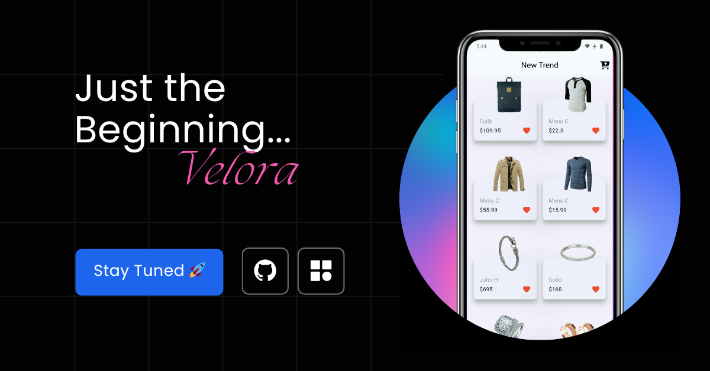

## 📸 Poster

<p align="center">
  
</p>

---

# 🛍️ Velora

🚀 **Just the Beginning** — Velora is a simple e-commerce Flutter app created as part of my learning journey.  
This is **version 1.0**, focusing on the **core fundamentals** of Flutter while keeping things clean and minimal.


---

## 📚 What’s Inside

Velora was built to practice and apply essential Flutter concepts:

- Building UI with **widgets**
- State management using **setState**
- Working with **external APIs**
- Using **FutureBuilder** for async data
- Navigating between screens
- Organizing code with **models, services, and custom widgets**

---

## 📱 Screens & Features

### **Home Page**
- Displays a grid of products retrieved from **FakeStoreAPI**.

### **Update Product Page**
- Edit product title, price, description, and image URL.
- Updates sent via a **PUT request** to the API.

### **Custom Widgets**
- Modular design with components like:
  - `CustomCard`
  - `CustomTextField`
  - `CustomButton`

---

## 🧱 Tech Stack

- **Flutter** (UI Framework)  
- **Dart** (Language)  
- `http` (Networking)  
- `modal_progress_hud_nsn` (Loading Indicator)  
- `font_awesome_flutter` (Icons)  

---

## 🗂 Project Structure

 ``` 
lib/
├── main.dart // Entry point
├── models/ // Product & Rating models
│ └── product_model.dart
├── services/ // API services
│ ├── get_all_product_service.dart
│ └── update_product.dart
├── screens/ // Screens
│ ├── home_page.dart
│ └── update_product_page.dart
├── widgets/ // Reusable components
│ ├── custom_card.dart
│ ├── custom_button.dart
│ └── custom_text_field.dart
 ``` 

---

## 🚀 Getting Started

```bash
git clone https://github.com/Omarelnasherty/Velora.git
cd Velora
flutter pub get
flutter run
 ``` 
🎯 Future Plans
This release focuses on fundamentals — the next versions will bring:

🛒 Full store with cart & checkout

💳 Payment integration (Stripe, PayPal)

🛠 Admin dashboard for managing products

🎨 Animations & polished UI/UX

🧩 Clean Architecture & advanced State Management

💡 Thanks for checking out Velora — the journey has just begun! 🚀
